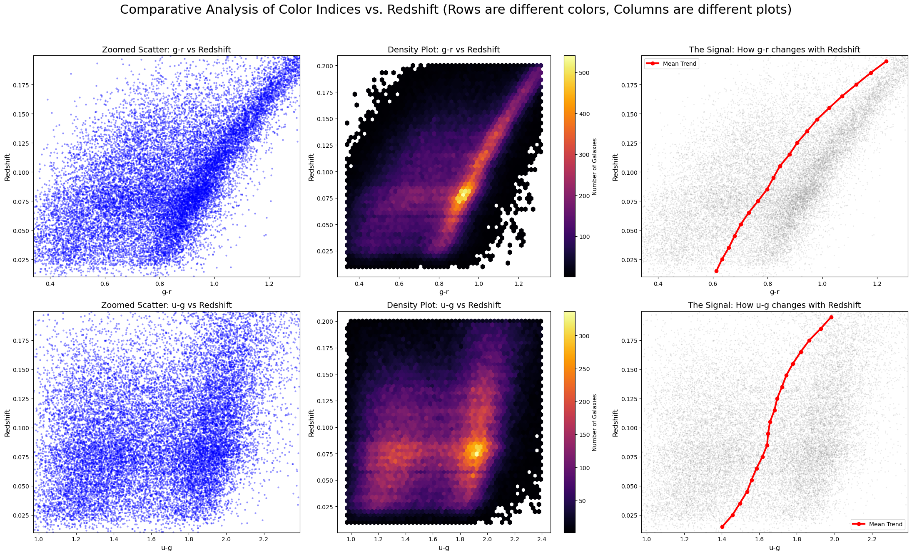
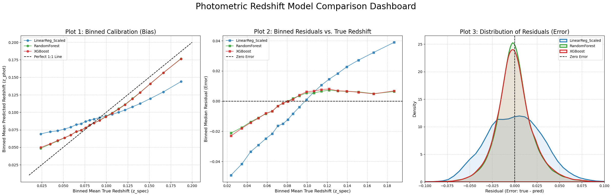

# Galaxy_Redshift-ColorIndices
Using SDSS data to predict galaxy photometric redshifts with ML models (Random Forest, XGBoost), confirming the relationship between color indices and redshift.

## Data Collection
The photometric and spectroscopic data was collected from the the Sloan Digital Sky Survey (SDSS) DR18, which provided a dataset of 189,000+ galaxies. 
For additional info about available data and tools, please refer to: https://skyserver.sdss.org

## Photometric Redshift Regression
This project's objective is to confirm a core relationship between galaxies' color indices and their distance, proxied by the redshift value, by building and validating Machine Learning models. 
In the following sections some definitions and concepts are provided in order to understand the analyis. 

### Filters and Color indices
Filters like "u, g or r" (for ultraviaiolet, green and red) allow a telescope to isolate and measure the amount of light emitted by a celestial body from that particular part of the spectrum. The brightness is measured in magnitudes. 

A color index is calculated by subtracting the magnitude in one filter from the magnitude in another, usually adjacent, filter.
The resulting value provides a lot of information regarding the type of galaxy that is being observed: 
* Low/negative value: The galaxy emits more light in the blue end of the spectrum, therefore it cointains massive, hot and young stars and is potentially forming stars.  
* High positive value: The galaxy emits more light in the red end of the specrum, and is therefore dominated by cool, old stars. Star formation has potentially stopped too. 

The color indices considered in this study as predictors are: u-g, g-r, r-i and i-z. 

### Redshift
**Redshift** ($z$) refers to a phenomenon where _the wavelength of light emitted by a celestial body is stretched_, shifting towards the red end of the electomagnetic spectrum. 

There are three main causes of redshift: 
* **Doppler redshift**: Caused by the relative motion of an object moving away from an observer through space;
* **Gravitational redshift**: Occurs when light escapes a strong gravitational field, losing energy as its wavelength is stretched;
* **Cosmological redshift**: It is caused by the expansion of space itself as the light travels through the universe. As space expands, the light waves are literally stretched along with it.

Redshift is calculated in the following way: 
$$\large
z = \frac {\lambda_{observed}-\lambda_{rest}}{\lambda_{rest}}
$$

* $\lambda_{observed}$ is the wavelength of the light measured by the observer
* $\lambda_{rest}$ is the "known" emitted wavelength of the light

In this project, redshift serves as a direct proxy for distance: a higher redshift means the galaxy is farther away and its light has been traveling and stretching for longer, making the galaxy look "redder" than what is should look like if it was closer. 

What we want to confirm here is, eventually, that a galaxy's color is directly related to its distance. 

## Galaxy Bimodality
Once the data was cleaned and preprocessed, some visualization was performed in order to check for easy-to-spot relationships between color indices and redshift. 

Interestingly, the plots highlighted the well-known phenomenon called "Galaxy Bimodality". 

As it can be seen in the u-g density plot, there is a bimodal trend. This happens because the data collected from SDSS contained different families of galaxies, that is Elliptical, Spiral and other types of galaxies. By plotting the color indices with redshift, it becomes immediately evident how most of the galaxies are literally splitted in two, presenting different ranges of values in a specific color index for the same redshift values. 

Galaxies naturally fall into two distinct populations:
* **The "Red Sequence"**: These are the Elliptical galaxies—old, massive, "red and dead" galaxies that are no longer forming stars. They have very little blue or ultraviolet (u) light, so they cluster together at high u-g and u-r values.

* **The "Blue Cloud"**: These are the Spiral galaxies—young, star-forming galaxies. They are full of hot, young, blue stars, so they are very bright in the u filter, giving them completely different u-g colors.

* **The "Green Valley"**: The sparse region between these two peaks contains galaxies that are in a transition phase, likely on their way from the blue cloud to the red sequence as their star formation shuts down.

## ML Models and metrics
For this study three regression models were trained: Random Forest, XGBoost and a Linear Regression. 
The primary goal was to identify the best performing model in predicting a galaxy distance (spectroscopic redshift value) with just the use of photometric data (four color indices). 

Here are the key final metrics of the models: 
|    | Model                    |    MAE |   RMSE |       R2 |   Spearman |
|---:|:-------------------------|-------:|-------:|---------:|-----------:|
|  1 | Random Forest            | 0.0152 | 0.0206 | 0.77662  |   0.857364 |
|  2 | XGBoost                  | 0.0156 | 0.0210 | 0.768048 |   0.851972 |
|  0 | Linear Regression_Scaled | 0.0248 | 0.0312 | 0.489872 |   0.703135 |

The Random Forest Model is the one that performs better for all four metrics considered, but it is closely followed by the XGBoost. 
The Linear Regression performed poorly, explaining only **48.99%** of the variance. This confirms the visual analysis: the relationship between color and redshift is complex and **non-linear**. The linear model's failure to capture this, along with its violation of core assumptions (linearity and homoscedasticity) shown in the notebook, justifies the need for more advanced models.
In fact, the Random Forest and XGBoost models, which *can* handle non-linear relationships, were far more successful, explaining **~78%** of the variance.

Here's the Comparative Dashboard between the three models: 

This dashboard visually confirms the models' performance. 

# Additional Notes
 This project uses `git-lfs` to handle the large `SDSS_GalaxyData.csv` file. You must have it installed.
